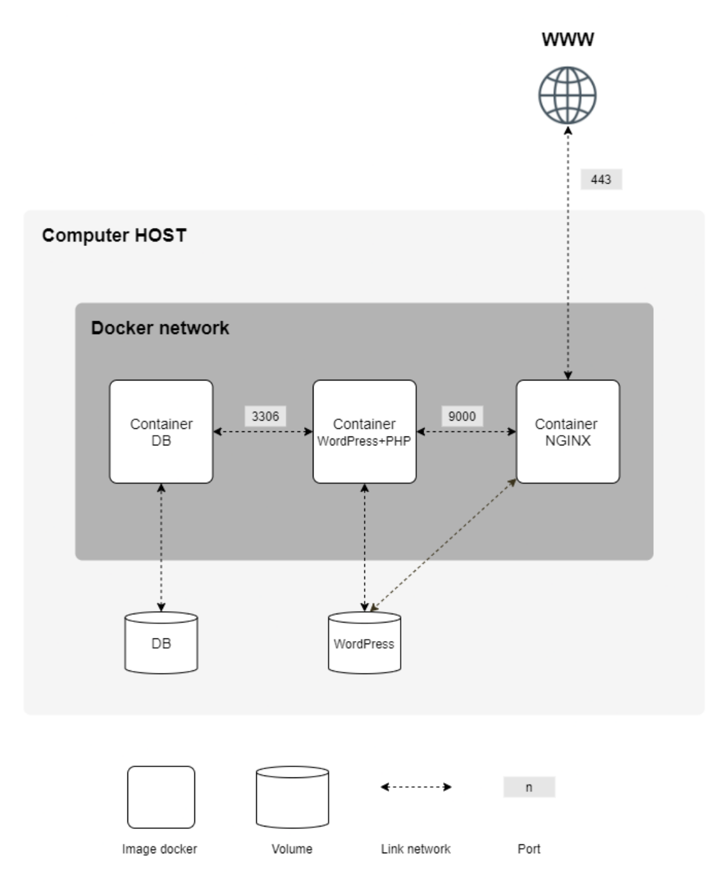

# Inception

### General Guidelines<br>
<ul>
	<li>이 프로젝트는 가상 머신(Virtual Machine)에서 수행해야 합니다.</li>
	<li>프로젝트 설정에 필요한 모든 파일은 <b>srcs</b> 폴더에 배치해야 합니다.</li>
	<li>Makefile을 생성하여 프로젝트 루트 디렉토리에 위치시켜야 합니다.</li>
	<li>Makefile은 전체 애플리케이션을 설정해야 하며, docker-compose.yml을 사용하여 Docker 이미지를 빌드해야 합니다.</li>
	<li>이 주제는 여러분의 배경 지식에 따라 아직 배우지 않은 개념을 실습해야 할 수 있습니다.</li>
	<li>따라서 Docker 사용법과 관련된 문서나 이 과제를 완료하는 데 유용한 자료를 많이 읽는 것을 주저하지 말 것을 권장합니다.</li>
</ul>
<br>

## 필수 요구 사항
> 이 프로젝트는 특정 규칙에 따라 여러 서비스를 포함하는 작은 인프라를 설정하는 것을 목표로 합니다.

### 프로젝트 환경 및 도구
<ul>
	<li>모든 작업은 <b>가상 머신(Virtual Machine)</b> 에서 수행해야 합니다.</li>
	<li>반드시 <b>Docker Compose</b>를 사용해야 합니다.</li>
</ul>

### Docker 이미지 및 컨테이너 규칙
<ul>
	<li>각 Docker 이미지는 해당 서비스와 동일한 이름을 가져야 합니다.</li>
	<li>각 서비스는 전용 컨테이너에서 실행되어야 합니다.</li>
</ul>

### 이미지 구축 규칙
<ul>
	<li>컨테이너는 성능을 위해 Alpine 또는 Debian의 마지막 이전 안정 버전을 기반으로 빌드해야 합니다. (선택은 자유)</li>
	<li>각 서비스마다 Dockerfile을 작성해야 하며, 각 Dockerfile은 Makefile에 의해<br>
	docker-compose.yml 파일에서 호출되어야 합니다.</li>
	<li>즉, 프로젝트의 Docker 이미지를 직접 빌드해야 합니다.<br>
	따라서 미리 만들어진 Docker 이미지를 가져오는 것은 금지되며, <br>
	DockerHub와 같은 서비스를 사용하는 것도 금지됩니다. (단, Alpine/ Debian 이미지는 이 규칙에서 제외됩니다.)</li>
</ul>

### 설정해야 할 항목

<ul>
	<li>NGINX를 포함하는 Docker 컨테이너 (TLSv1.2 또는 TLSv1.3만 지원).
	<br>A Docker container that contains NGINX with TLSv1.2 or TLSv1.3 only.</li>
	<li>NGINX 없이 WordPress + php-fpm을 포함하는 Docker 컨테이너 (nginx는 포함하지 않음).
	<br>A Docker container that contains WordPress + php-fpm (it must be installed and
configured) only without nginx.</li>
	<li>MariaDB를 포함하는 Docker 컨테이너 (nginx는 포함하지 않음).
	<br>A Docker container that contains MariaDB only without nginx</li>
	<li>WordPress 데이터베이스를 포함하는 볼륨.
	<br>A volume that contains your WordPress database.</li>
	<li>WordPress 웹사이트 파일을 포함하는 두 번째 볼륨
	<br>A second volume that contains your WordPress website files</li>
	<li>컨테이너 간 연결을 위한 <b>Docker-network</b>.
	<br>A <b>docker-network</b> that establishes the connection between your containers.</li>
</ul>
<b>컨테이너는 충돌 시 자동 재시작해야 합니다.</b>


## ℹ️ tip
	Docker 컨테이너는 가상 머신이 아닙니다. 따라서,
	컨테이너를 실행할 때 tail -f와 같은 임시적이고 비효율적인 해결책(hacky patch)을 사용하는 것은 권장되지 않습니다.
	데몬(daemon)의 작동 방식에 대해 읽어보고, 이를 사용하는 것이 적절한지 판단하십시오.


## ⚠️ warning
	물론, network: host, --link, 또는 links:의 사용은 금지됩니다.
	네트워크 설정은 반드시 docker-compose.yml 파일에 포함되어야 합니다.
	컨테이너는 무한 루프를 실행하는 명령어로 시작되어서는 안 됩니다.
	이는 entrypoint로 사용된 명령어와 entrypoint 스크립트에 사용된 명령어에도 적용됩니다.
	다음은 금지된 비정상적인 패치(hacky patches) 예시입니다: tail -f, bash, sleep infinity, while true.

## ℹ️ tip
	PID 1 및 Dockerfile 작성을 위한 모범 사례를 읽어보십시오.
___
<li>당신의 워드프레스 데이터베이스는 두 개의 유저가 있어야 하며, 그 중 하나는 관리자입니다. <br>
관리자의 이름에는 admin/Admin/administrator/Administrator 등이 포함될 수 없습니다. <br>
ex: admin, administrator, Administrator, admin-123, 등 </li>

## ℹ️ tip
	당신의 볼륨은 Docker를 사용하는 호스트 머신의 /home/login/data 폴더에서 사용할 수 있습니다.
	물론 로그인을 당신의 것으로 바꿔야합니다.
___

<ul>
	<li>더 간단하게 만들기 위해, 도메인 이름을 로컬 IP 주소를 가리키도록 설정해야 합니다.</li>
	<li>이 도메인 이름은 반드시 <b>login.42.fr</b> 형식이어야 합니다.
	<br>여기서 <b>login</b>은 자신의 로그인 이름으로 대체해야 합니다.</li>
	<li>예를 들어, 만약 당신의 로그인 이름이 <b>wil<b>이라면, <b>wil.42.fr<b>은 wil의 웹사이트를 가리키는 IP 주소로 리디렉션됩니다.</li>
</ul>

## ⚠️ warning
	최신 태그(latest tag)는 사용이 금지됩니다.
	Dockerfile에 비밀번호를 포함해서는 안 됩니다.
	환경 변수를 사용하는 것이 필수적입니다.
	또한, 환경 변수를 저장하기 위해 .env 파일을 사용하는 것이 강력히 권장됩니다.
	.env 파일은 srcs 디렉터리의 루트에 위치해야 합니다.
	NGINX 컨테이너는 포트 443을 통해 TLSv1.2 또는 TLSv1.3 프로토콜을 사용하여 인프라에 대한 유일한 진입점이어야 합니다.
___
다음은 예상 결과를 나타내는 예시 다이어그램입니다.



다음은 예상되는 디렉토리 구조의 예입니다:

```
$> ls -alR
total XX
drwxrwxr-x 3 wil wil 4096 avril 42 20:42 .
drwxrwxrwt 17 wil wil 4096 avril 42 20:42 ..
-rw-rw-r-- 1 wil wil XXXX avril 42 20:42 Makefile
drwxrwxr-x 3 wil wil 4096 avril 42 20:42 srcs
./srcs:
total XX
drwxrwxr-x 3 wil wil 4096 avril 42 20:42 .
drwxrwxr-x 3 wil wil 4096 avril 42 20:42 ..
-rw-rw-r-- 1 wil wil XXXX avril 42 20:42 docker-compose.yml
-rw-rw-r-- 1 wil wil XXXX avril 42 20:42 .env
drwxrwxr-x 5 wil wil 4096 avril 42 20:42 requirements
./srcs/requirements:
total XX
drwxrwxr-x 5 wil wil 4096 avril 42 20:42 .
drwxrwxr-x 3 wil wil 4096 avril 42 20:42 ..
drwxrwxr-x 4 wil wil 4096 avril 42 20:42 bonus
drwxrwxr-x 4 wil wil 4096 avril 42 20:42 mariadb
drwxrwxr-x 4 wil wil 4096 avril 42 20:42 nginx
drwxrwxr-x 4 wil wil 4096 avril 42 20:42 tools
drwxrwxr-x 4 wil wil 4096 avril 42 20:42 wordpress
./srcs/requirements/mariadb:
total XX
drwxrwxr-x 4 wil wil 4096 avril 42 20:45 .
drwxrwxr-x 5 wil wil 4096 avril 42 20:42 ..
drwxrwxr-x 2 wil wil 4096 avril 42 20:42 conf
-rw-rw-r-- 1 wil wil XXXX avril 42 20:42 Dockerfile
-rw-rw-r-- 1 wil wil XXXX avril 42 20:42 .dockerignore
drwxrwxr-x 2 wil wil 4096 avril 42 20:42 tools
[...]
./srcs/requirements/nginx:
total XX
drwxrwxr-x 4 wil wil 4096 avril 42 20:42 .
drwxrwxr-x 5 wil wil 4096 avril 42 20:42 ..
drwxrwxr-x 2 wil wil 4096 avril 42 20:42 conf
-rw-rw-r-- 1 wil wil XXXX avril 42 20:42 Dockerfile
-rw-rw-r-- 1 wil wil XXXX avril 42 20:42 .dockerignore
drwxrwxr-x 2 wil wil 4096 avril 42 20:42 tools
[...]
$> cat srcs/.env
DOMAIN_NAME=wil.42.fr
# certificates
CERTS_=./XXXXXXXXXXXX
# MYSQL SETUP
MYSQL_ROOT_PASSWORD=XXXXXXXXXXXX
MYSQL_USER=XXXXXXXXXXXX
MYSQL_PASSWORD=XXXXXXXXXXXX
[...]
$>
```

## ⚠️ warning
	명백한 보안상의 이유로, 모든 자격 증명, API 키, 환경 변수 등은 로컬의 .env 파일에 저장하고 Git에 무시되어야 합니다.
	공개적으로 저장된 자격 증명은 프로젝트의 실패로 직결될 것입니다.
___

# Chapter V - 보너스 파트
> 이 프로젝트에서 보너스 파트는 단순함을 목표로 합니다.
각 추가 서비스마다 Dockerfile을 작성해야 합니다. <br>따라서 각 서비스는 자체 컨테이너에서 실행되며, 필요하면 전용 볼륨을 가질 것입니다.

## 보너스 목록:

<ul>
	<li>WordPress 웹사이트에서 캐시를 적절히 관리하기 위해 Redis 캐시를 설정하세요.</li>
	<li>WordPress 웹사이트의 볼륨을 가리키는 FTP 서버 컨테이너를 설정하세요.</li>
	<li>PHP를 제외한 언어로 간단한 정적 웹사이트를 만드세요(예: 포트폴리오 사이트 또는 이력서를 소개하는 사이트).</li>
	<li>Adminer를 설정하세요.</li>
	<li>유용하다고 생각하는 서비스를 설정하세요. 디펜스(발표) 중에 해당 선택을 정당화해야 합니다.</li>
</ul>

## ℹ️ tip
	보너스 부분을 완료하기 위해 추가 서비스를 설정할 수 있습니다.
	이 경우, 필요에 따라 더 많은 포트를 열어 사용할 수 있습니다.

## ⚠️ warning
	보너스 부분은 필수 항목이 완벽하게 완료된 경우에만 평가됩니다.
	완벽하다는 것은 필수 항목이 모두 구현되어 문제없이 동작한다는 것을 의미합니다.
	필수 요구 사항을 모두 충족하지 못한 경우, 보너스 부분은 전혀 평가되지 않습니다.
___
